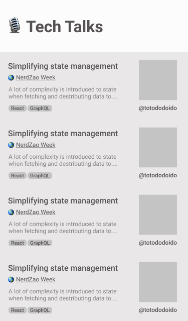
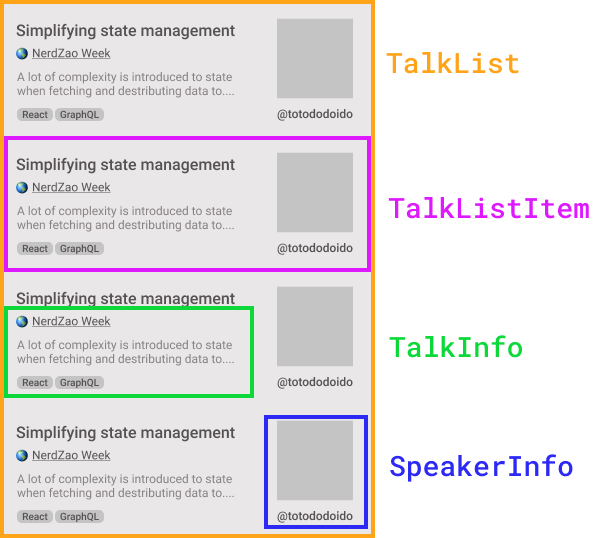

import { Appear } from "mdx-deck";
import { Image } from "mdx-deck";
import { Split } from "mdx-deck/layouts";
import { CodeSurfer } from "mdx-deck-code-surfer";

export { theme } from "./theme";

#### GraphQL & Relay presents:

# Simplifying State Management

### with smart data fetching

---


---

## Agenda

<ul style={{ textAlign: "left" }}>
  <Appear>
    <li>Example: Tech Talks</li>
    <li>Traditional REST approach</li>
    <li>GraphQL</li>
    <li>Relay</li>
  </Appear>
</ul>

---

### Tech Talks

---



---



```notes
- view hierarchy
- fetch all the data for the hierarchy
- re render entire view
```

---

#### Fetch _all_ the data for the hierarchy with a loading indicator,

#### then re-render the _entire_ view once the data is ready

---

<CodeSurfer
  code={require("!raw-loader!././snippets/talklist-data-needs.ts")}
  steps={[
    { notes: "Talk list data requirements" },
    { range: [3, 15], notes: "TalkItem" },
    { range: [5, 10], notes: "TalkInfo" },
    { range: [12, 15], notes: "SpeakerInfo" }
  ]}
/>

---

#### common data fetching approach:

Root component fetch the data for all it's children

```notes
- presentational vs container
```

---

#### Rest endpoints

`"/talks"`

`"/events"`

`"/speakers"`

---

<CodeSurfer
  code={require("!raw-loader!././snippets/api-responses.ts")}
  steps={[
    { notes: "" },
    {
      notes: "Load data hierarchy on component initialization",
      lines: [1, 14]
    },
    { notes: "Each talk references the speaker and event ids", lines: [2, 3] },
    {
      notes: "Each speaker and event is requested separatedly",
      range: [5, 11]
    },
    { notes: "", lines: [13] }
  ]}
/>

```notes
- other views sharing data
- live trending example
- optimize state shape for CRUD
- avoid nesting
```

---

Underfetching often leads to n + 1 problem

---

1 request to fetch the talks

N requests to fetch each missing reference

---

<CodeSurfer code={require("!raw-loader!././snippets/overfetching.ts")} />

---

Resourceful REST often leads to **overfetching**

---

Storing the result with normalized state

```notes
- works great for nested structures referencing each other
- avoid duplications
- allow multiple queries to store in the same format
```

---

<CodeSurfer
  code={require("!raw-loader!././snippets/normalized-state-shape.ts")}
  steps={[
    { notes: "" },
    { notes: "", range: [3, 11] },
    { notes: "", lines: [5], range: [14, 18] },
    { notes: "", lines: [6], range: [21, 25] },
    { notes: "" }
  ]}
/>

---

<CodeSurfer
  code={require("!raw-loader!././snippets/talklist-data-needs.ts")}
  steps={[{ notes: "Data requirements recap" }]}
/>

---

Map state to props

---

<CodeSurfer
  code={require("!raw-loader!././snippets/mapStateToProps.tsx")}
  steps={[
    { notes: "" },
    { notes: "", range: [3, 11] },
    { notes: "mapStateToProps(state)", lines: [3] },
    { notes: "Build denormalized talks list", range: [4, 10] },
    { notes: "by populating event and speaker", range: [6, 8] },
    { notes: "TalkList", range: [13, 21] },
    { notes: "", lines: [23] },
    { notes: "" }
  ]}
/>

---

### Garbage collection

```notes
- State grows indefinitely
- Consider native
```

---

#### UX Best Practices

- Manage UI loading and error state
- Retry policy
- Cache management
- View synchronization
- Optimistic Updates

```notes
optimistic update: feedback while waiting for a server response
```

---

## Enter GraphQL and Relay

---

### GraphQL

---

GraphQL gives clients the power to ask for exactly what they need

```notes
- Make a single reach request
- Types benefits
```

---

<CodeSurfer code={require("!raw-loader!././snippets/talklist-data-needs.ts")} />

---

<CodeSurfer code={require("!raw-loader!././snippets/TalkListQuery.graphql")} />

---

### Relay

---

Relay is a GraphQL client with many UX best practices baked in

---

Basic example with `QueryRenderer`

---

<CodeSurfer
  code={require("!raw-loader!././snippets/query-renderer.tsx")}
  steps={[
    { notes: "" },
    { notes: "", range: [7, 13] },
    { notes: "", range: [15, 34] },
    { notes: "", range: [36, 49] },
    { notes: "", range: [41, 46] }
  ]}
/>

---

Missing piece: data specification composition

---

<CodeSurfer
  code={require("!raw-loader!././snippets/SpeakerInfo.tsx")}
  steps={[
    { notes: "" },
    { notes: "", range: [5, 10] },
    { notes: "", range: [14, 17] },
    { notes: "", range: [14, 17], lines: [7, 8] }
  ]}
/>

---

<CodeSurfer
  code={require("!raw-loader!././snippets/Talkinfo.tsx")}
  steps={[{ notes: "" }, { notes: "", range: [18, 22], lines: [9, 10] }]}
/>

---

<CodeSurfer
  code={require("!raw-loader!././snippets/TalkListItem.tsx")}
  steps={[{ notes: "" }, { notes: "", range: [18, 24], lines: [10, 11, 12] }]}
/>

---

<CodeSurfer
  code={require("!raw-loader!././snippets/TalkListPage.tsx")}
  steps={[{ notes: "" }, { notes: "", range: [20, 24], lines: [8, 12] }]}
/>

---

## Relay goodies

---

### Data binding (api -> props)

---

### Cache management

---

### View synchronization

```notes
- speaker photo update example
```

---

Updates across the store updates `any` component that depends on that data

```notes
- Relay mantains a mapping from each view to the set of IDs it references
- Also works for writes
```

---

### Garbage collection

---

### Declarative data fetching

---

### Compile-time query generation

---

- Remove runtime overhead
- Queries can be persisted

---


---

## We are hiring!

---

## Thank you 👌
